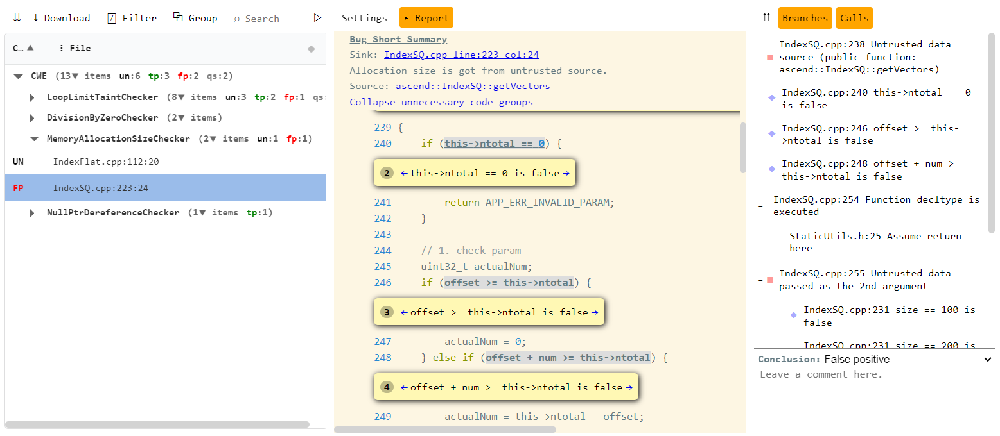

The presentation of result is depend on which reporter was used, during the analyses. The examples of the result of each reporter you can see below


<details>

<summary>Result in JSON
</summary>
Result will be presented in cooddy_result.json, which is located in the current working directory by default or in location passed to argument results-path. This file contains list of problems, found in scope.

By calling following example of analyses

```bash
/mnt/d/work/Cooddy/build/release/cooddy --scope=/mnt/d/work/kvdb_test --results-path=/mnt/d --reporter=json
```

the content of result will be following

```json
{
   "start_time":"2021-10-06T08:30:08.339Z",
   "end_time":"2021-10-06T08:30:08.557Z",
   "profile":"default.profile",
   "command_line":"--scope=/mnt/d/work/kvdb_test --results-path=/mnt/d --reporter=json",
   "git_commit":"50cff76197957237806a704ff1c711e220f58099",
   "git_version":"v1_7",
   "problems":[
      {
         "file":"/mnt/d/work/Cooddy/test/test_cases/analyzerToolTest/test_trace.cpp",
         "line":5,
         "offset":9,
         "length":7,
         "problem_class":{
            "name":"SSR_1.1.2.1",
            "severity":"ERROR",
            "profile":"Common Weakness Enumeration",
            "inspection_name":"NullPtrDereferenceChecker"
         },
         "highlighted_element":"",
         "description":"Null dereference",
         "trace":[
            {
               "file":"/mnt/d/work/Cooddy/test/test_cases/analyzerToolTest/test_trace.cpp",
               "line":12,
               "col":22,
               "end_line":12,
               "end_col":28
            },
            {
               "file":"/mnt/d/work/Cooddy/test/test_cases/analyzerToolTest/test_trace.cpp",
               "line":13,
               "col":15,
               "end_line":13,
               "end_col":22
            },
            {
               "file":"/mnt/d/work/Cooddy/test/test_cases/analyzerToolTest/test_trace.cpp",
               "line":5,
               "col":9,
               "end_line":5,
               "end_col":16
            }
         ]
      }
   ]
}
```

</details>


<details>

<summary>Result in human-readable format
</summary>
By default result will be printed in output of the console. If saving result in human-readable format in file is required, you need to pass path to location of result file to argument results-path. This file contains list of problems, found in scope.

By calling following example of analyses

```bash
/mnt/d/work/Cooddy/build/release/cooddy --scope=/mnt/d/work/kvdb_test --results-path=/mnt/d
```

the content of result will be following

```
Problem found. NullPtrDereferenceCheker: Null dereference File: /mnt/d/work/test_projects/sqlite_vm/mnt/storage/projects-for-analysis/sqlite/bld/sqlite3.c:59362:6, Trace: File: /mnt/d/work/test_projects/sqlite_vm/mnt/storage/projects-for-analysis/sqlite/bld/sqlite3.c:55128:44 File: /mnt/d/work/test_projects/sqlite_vm/mnt/storage/projects-for-analysis/sqlite/bld/sqlite3.c:55128:44 Problem found. UninitializedMemoryUsageChecker: Do not access uninitialized memory. File: /mnt/d/work/test_projects/sqlite_vm/mnt/storage/projects-for-analysis/sqlite/bld/sqlite3.c:79959:13, Trace: File: /mnt/d/work/test_projects/sqlite_vm/mnt/storage/projects-for-analysis/sqlite/bld/sqlite3.c:79869:3 Problem found. NullPtrDereferenceCheker: Null dereference File: /mnt/d/work/test_projects/sqlite_vm/mnt/storage/projects-for-analysis/sqlite/bld/sqlite3.c:79768:5, Trace: File: /mnt/d/work/test_projects/sqlite_vm/mnt/storage/projects-for-analysis/sqlite/bld/sqlite3.c:80353:18 File: /mnt/d/work/test_projects/sqlite_vm/mnt/storage/projects-for-analysis/sqlite/bld/sqlite3.c:80324:28 Problem found. NullPtrDereferenceCheker: Null dereference File: /mnt/d/work/test_projects/sqlite_vm/mnt/storage/projects-for-analysis/sqlite/bld/sqlite3.c:80356:12, Trace: File: /mnt/d/work/test_projects/sqlite_vm/mnt/storage/projects-for-analysis/sqlite/bld/sqlite3.c:80326:29 Problem found: Strictly check integer operations to ensure no overflow, wrap or division by zero. File: /mnt/d/work/test_projects/sqlite_vm/mnt/storage/projects-for-analysis/sqlite/bld/sqlite3.c:28704:35, Trace: File: /mnt/d/work/test_projects/sqlite_vm/mnt/storage/projects-for-analysis/sqlite/bld/sqlite3.c:28701:11
```

</details>


<details>

<summary>Result in CSV format
</summary>
Result will be presented in cooddy_result.csv, which is located in the current working directory by default or in location passed to argument results-path. This file contains list of problems, found in scope.

By calling following example of analyses

```bash
/mnt/d/work/Cooddy/build/release/cooddy --scope=/mnt/d/work/kvdb_test --results-path=/mnt/d --reporter=csv
```

In Excel the content of result will be following:


</details>


<details>

<summary>Result in CSV format with HTML report
</summary>
Result will be presented in cooddy_result.csv, which is located in the current working directory by default or in location passed to argument results-path. This file contains list of problems, found in scope.

By calling following example of analyses

```bash
/mnt/d/work/Cooddy/build/release/cooddy --scope=/mnt/d/work/test --reporter=csv-html
```

### In Excel the content of result will be following:


When clicking to file with trace with name report-f8a8ec.html you can see description of error trace.

Here you can review source code step by step to determine the source of some specific error, with description on each step.


</details>


<details>

<summary>Result in HTML report
</summary>
Result will be presented in cooddy_result.html, which is located in the current working directory by default or in location passed to argument results-path. This file contains list of problems, found in scope.

By calling following example of analyses

```bash
/mnt/d/work/Cooddy/build/release/cooddy --scope=/mnt/d/work/test --reporter=html
```

In HTML the content of result will be following:




</details>
